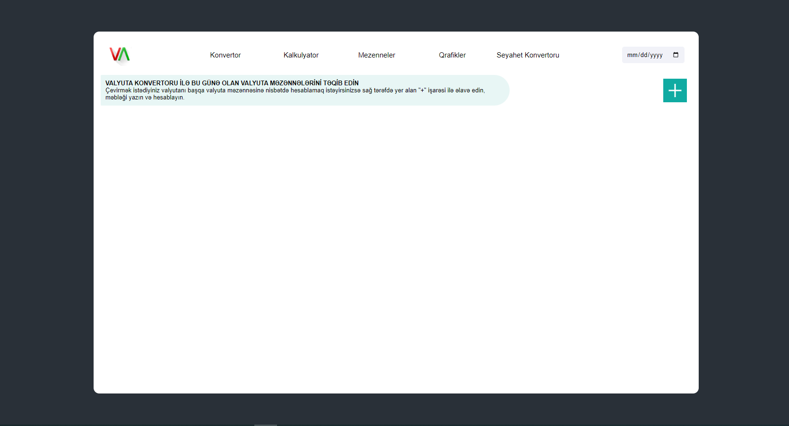

# GITHUB INDICATORS

# Convertor-currency-React

Hello, I created with React and RestAPI Convertor-currency-React. 

## ## RULES OF USE

> **STEP-1:** `https://github.com/cavidsuleyman/Convertor-currency-React.git`  
> **STEP-2:**  enter the `Convertor-currency-React` folder that appears  
> **STEP-3:**  Open the folder you are in in a text editor  
> **STEP-4:**  Run all the files in the main folder "npm start"  
> **STEP-5:**  to download the project as `.zip`  [here](https://github.com/cavidsuleyman/Convertor-currency-React/archive/refs/heads/master.zip) click  

## Technology

This project was developed using the following technologies

| No | Technique | Purpose |
| - | ---------- | --------------------- |
| 1 | React | Building a single-page application |
| 2 | RestAPI |  Fetch Data |
| 3 | VSCode | Text editor used in the project |

## SAMPLE SCREEN APPEARANCE

